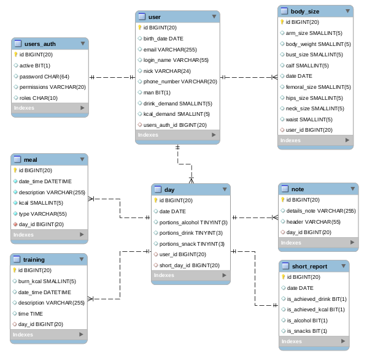

# HealthCalendar


---

## Table of contents

- [Description](#description)
    [Creation purpose](#creation-purpose)
- [Main groups](#main-groups)
    - [User](#user)
    - [Body measurement](#body-measurement)
    - [Day report](#report-of-the-specific-day)
- [Architecture](#architecture)
    - [DataBase](#database)
    - [Security](#security)
    - [Usage](#usage)
- [Applied technologies](#applied-technologies)
- [Setup](#setup)
    - [Running app](#running-the-application)
    - [Running test](#running-the-test)
- [Features](#features)
- [Status](#status)
    - [API](#api)
- [Authors](#authors)

## Description

The [HealthCalendar](https://pgajek.github.io/HealthCallendar/home) application has been 
created for active people who want to easily manage and archive the results of their hard work.

Functionality's based on a calendar. Each user has a number of options for entering basic data per each day:
- the number of liquids **drunk** (in portions of 250ml)
- the number of **meals** eaten, along with their calorie content
- number of **snacks** / **alcohol** consumed (if any)
- performed **trainings** with the type, duration along with the amount of burned calories 
- additional **notes**, e.g. a holiday trip, sick leave etc.

Additionally, each user can check work progress by updating body measurement, i.e.:
**weight**, **neck size**, **arm size**, **chest size**, **waist size**, **hip size**, 
**thigh size**, **calf size**.
So it has the ability to compare the current results with the previous ones.

> Frontend's being created by a colleague, who has been working on it from the beginning of the project

#### Creation purpose

The project has been created at the request of my fiancee and her active friends.
They will determinate how the application will look like in the future.

## Main groups

A Swagger UI's implemented in the project. It can be helpful in navigating the API.

##### User
To receive information about user send the request by using GET method to path 
`**/api/user/login-name/{loginName}` (*with a Bearer Token*)

##### Body measurement
To receive a body measurement result from a specific day send the request by using GET method to path 
`**/api/body/{date}/{userId}` (*with a Bearer Token*) 

##### Report of the specific day
To receive basic information about a specific day, send the request by using the GET method to path 
`**/api/report/{date}/{userId}` (*with a Bearer Token*).
This endpoint returns the object report, which contains:

```
Long id;
LocalDate date;
Long userId;
int portionsDrink;
int portionsAlcohol;
int portionsSnack;
String nick;
String lastDateMeasureBody;
boolean isAchievedDrink;
boolean isAchievedKcal;
```

To receive other data from a specific day, send the request by using GET methods (*with a Bearer Token*) 
to following addresses:
- `**/api/meal/dto/date/user-id/{date}/{userId}` to get DailyDiet object
- `**/api/training/trainings-summary/{dayId}` to get TrainingsSummary object
- `**/api/note/day-id/{dayId}` to get List<Note> collection of Note object
- `**/api/short-report/{date}/{userId}` to get short report 30 days before and after 
the date entered.

> it's possible to receive all information for a specific day, from the endpoint
`**/api/report/long/{date}/{userId}` GET method (*with a Bearer Token*).

## Architecture

#### DataBase

The application uses relational database MySQL, dependency diagram below.



#### Security

- For security reasons, the application requires authorization via token.

- In addition, the backend application uses the certification issued by myself.

> Used SHA-256 Secure Hash Algorithm.

#### Usage

Initially, you need to authenticate the received an access token.
You can do this by login at path `**/login`. 

## Applied technologies

##### Backend:
- Java - version 1.8.0
- Maven - version 3.5.2
- Spring Boot - version 2.2.0
- Spring Security - version 5.2.0
- Json Web Token - version 0.9.1
- Spring JPA - version 2.2.0
- REST API
- application container Tomcat - version 9.0.27
- JUnit - version 5.6.2
- assertJ - version 3.14.0
- Swagger UI - version 2.7.0
- Lombok - version 1.18.10

## Setup

To clone and run this application, you'll need [Git](https://git-scm.com), [Maven](http://maven.apache.org/), 
[Java SE](https://www.oracle.com/java/technologies/javase-downloads.html) and [MySQL DB](https://www.mysql.com/)
installed on your computer. From your command line:

#### Running the application

```bash
# Clone this repository
$ git clone https://github.com/CezaryZal/HealthCalendar

# Go into the repository
$ cd HealthCalendar

# Run the app
$ mvn spring-boot:run
```

> open the helpful UI Swagger use the path: `**/HealthCalendar/swagger-ui.html`

#### Running the test

To run the *test* via Maven:

```shell
$ mvn test
```

## Features 

#### To-do list

- add validation input value/object
- add tests
- add 2FA with email

## Status

[HealthCalendar](https://pgajek.github.io/HealthCallendar/home) project's in alpha phase - version 1.0.0

#### API

[HealthCalendar API](https://164.132.97.42:8443/health-calendar)

## Authors

* **Cezary Zalewski** - *Backend* - [GitHub profile](https://github.com/CezaryZal)
* **Patryk Gajek** - *Frontend* - [GitHub profile](https://github.com/pgajek)
